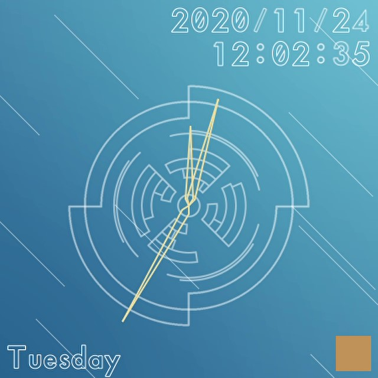
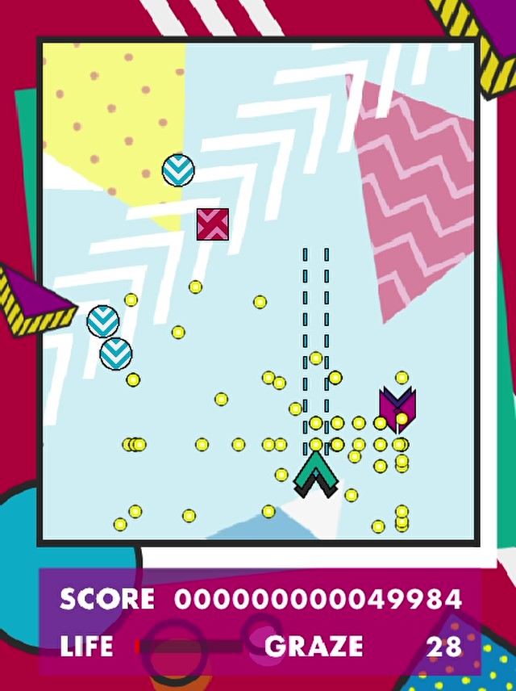

## 🐱Chiramium / ちらみ🐱

I belong to 4J (Computer Sciences) in Nagano National College of Technology (NNCT, NITNC).

## Languages and Tools

## Products

### [Satellite](https://github.com/Chiramium/Satellite)

A simplified clock application (for Windows). 

 

----

### [PlayGround](https://github.com/Chiramium/PlayGround)

A shooting game with pop design (for Windows). 

 

----

